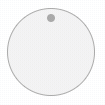
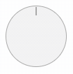
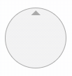
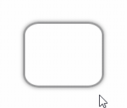

# knob.js

Knob.js is an element for spinning and getting the degree.

## Demo

[url-demo-knob]: https://lf2com.github.io/knob.js/demo/knob
[url-demo-cd]: https://lf2com.github.io/knob.js/demo/cd

[Knob][url-demo-knob]

Sets knob with min, max, and degree. And also we can change the size and style of knob.

[CD][url-demo-cd]

An application of knob with CD styled media player.

## Usage

Install from [GitHub](https://github.com/lf2com/knob.js) or [npmjs](https://www.npmjs.com/package/@lf2com/knob.js):

```sh
npm install @lf2com/knob.js
# or
npm install https://github.com/lf2com/knob.js
```

Import to your project:

```js
import '@lf2com/knob.js';
// or
require('@lf2com/knob.js');
```

### Browser

You can add the script file to the HTML file:

```html
<script src="PATH/TO/knob.js"></script>

<!-- create knob -->
<knob-line min="-30" max="120"></knob-line>

<!-- or create knob by JS -->
<script>
  const knob = document.createElement('knob-line');
  knob.min = -30; // or knob.setAttribute('min', -30);
  knob.max = 120; // or knob.setAttribute('max', 120);
  
  // or if using jQuery
  const $knob = $('<knob-line>').attr({
    min: -30,
    max: 120,
  });
</script>
```

### Styled Knobs

We defined some styled knobs that we can use them directly without styling knob ourselves.

#### Dot Knob



```html
<knob-dot></knob-dot>
```

#### Line Knob



```html
<knob-line></knob-line>
```

#### Triangle Knob



```html
<knob-triangle></knob-triangle>
```

### Custom Knob

We can custom knob with pure knob:



**NOTICE: When customing knob we need to append child node to `<knob-base>` and style the child node.**

```html
<style>
  knob-base > .knob {
    width: 100px;
    height: 80px;
    box-shadow: 0 0 5px #999;
    box-sizing: border-box;
    border-radius: 20%;
    border: 3px solid #ccc;
    display: inline-block;

    /* ensure the knob can receive mouse/touch event */
    background-color: rgba(0, 0, 0, 0);
  }
</style>

<knob-base>
  <!-- knob not rotates itself but its children -->
  <span class="knob"></span>
</knob-base>
```

## Build

You can build knob.js by the command:

```sh
npm run build
```

And we can find the built file at `./dist/knob.min.js`.

## Properties

There are properties for us to control knob. All these attributes are designed to change the knob properties.

**NOTICE: `knob.getAttribute(...)` won't return the latest value of the attribute. The attribute is designed for setting value directly with HTML code.**

### .disabled

Disabled of knob. If the knob is disabled, we can't spin it.

```html
<!-- disable knob -->
<knob-line disabled></knob-line>
```

```js
// disable knob
knob.disabled = true;
// or
knob.setAttribute('disabled', '');

// check if knob is disabled
if (knob.disabled) {
  console.log('Knob is disabled');
}
```

### .degree/.value

Degree of knob. We can get or set the degree of knob with the value in unit of degree.

```html
<!-- set degree -->
<knob-dot degree="30"></knob-dot>
```

```js
// set degree
knob.degree = 30;
// or
knob.value = 30;
// or
knob.setAttribute('degree', 30);

// get degree
console.log('degree:', knob.degree);
// or
console.log('degree:', knob.value);
```

### .min/.max

Minimum or maximum degree of knob. If set the value, knob degree would be bounded.

```html
<!-- set min/max -->
<knob-triangle min="-60" max="150"></knob-triangle>
```

```js
// set min/max
knob.min = -60;
knob.max = 150;
// or
knob.setAttribute('min', -60);
knob.setAttribute('max', 150);

// get min/max
console.log('min:', knob.min);
console.log('max:', knob.max);
```

## Events

Knob supports the following events:

### spinstart

Start of spinning.

> **This event can be cancelled.**

Values of `event.detail`:

| Name | Type | Description |
| -: | :-: | :- |
| degree | _number_ | Current degree of knob. |
| lastDegree | _number_ | Degree of beginning. Should be the same as `degree`. |
| offsetDegree | _number_ | Offset degree compared to degree of beginning. Should be `0`. |

```js
knob.addEventListener('spinstart', (event) => {
  const {
    detail: {
      degree, // current degree
      lastDegree, // degree of beginning
      offsetDegree, // degree - lastDegree
    },
  } = event;

  // if you want to cancel spinning
  event.preventDefault();
})
```

### spinning

As the knob is being spinned.

> **This event can be cancelled.**

Values of `event.detail`:

| Name | Type | Description |
| -: | :-: | :- |
| degree | _number_ | Current degree of knob. |
| lastDegree | _number_ | Degree of last spinning event. **_Not the beginning degree_**. |
| offsetDegree | _number_ | Offset degree compared to degree of beginning. |

```js
knob.addEventListener('spinning', (event) => {
  const {
    detail: {
      degree, // current degree
      lastDegree, // last spinned degree
      offsetDegree, // current degree - beginning degree
    },
  } = event;
  
  // if you want to cancel spinning
  event.preventDefault();
});
```

### spinend

End of spinning.

Values of `event.detail`:

| Name | Type | Description |
| -: | :-: | :- |
| degree | _number_ | Current degree of knob. |
| lastDegree | _number_ | Degree of beginning. |
| offsetDegree | _number_ | Offset degree compared to degree of beginning. |

```js
knob.addEventListener('spinend', (event) => {
  const {
    detail: {
      degree, // current degree
      lastDegree, // degree of beginning
      offsetDegree, // degree - lastDegree
    },
  } = event;
});
```

### change

Change of knob degree such as spinning and setting degree.

Values of `event.detail`:

| Name | Type | Description |
| -: | :-: | :- |
| degree | _number_ | Current degree of knob. |
| lastDegree | _number_ | Degree before changing. |
| offsetDegree | _number_ | Offset degree compared to the last degree. |

```js
knob.addEventListener('change', (event) => {
  const {
    detail: {
      degree, // current degree
      lastDegree, // degree before changing
      offsetDegree, // degree - lastDegree
    },
  } = event;
});
```

## License

[url-license]: https://github.com/lf2com/knob.js/blob/master/LICENSE

Knob.js is [MIT licensed][url-license].
